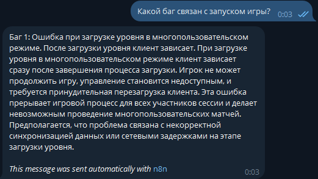
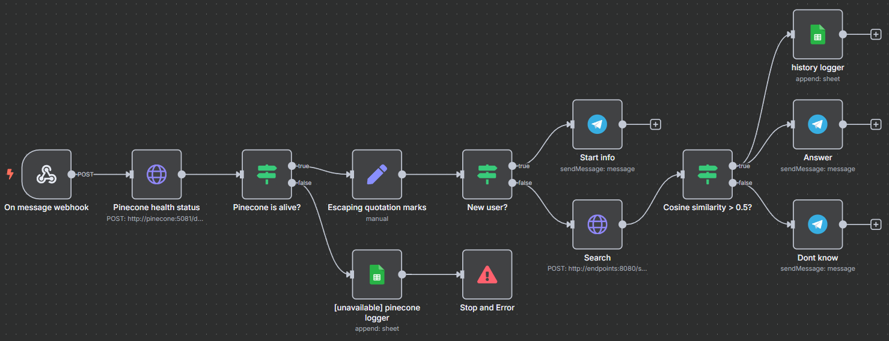

# Решение тестового задания

## Описание задачи
Создать чат-бота, который будет использовать систему Pinecone для хранения и поиска информации о багов в игре. Бот должен получать
запросы от пользователя, извлекать данные из базы с помощью RAG (retrieval-augmented generation) и выводить описание ошибок или багов,
основываясь на информации в векторной базе данных. Бота можно реализовать на любом удобном языке программирования.

**Заявленный срок на выполнение: 1 рабочий день**. Как следствие из этого - некоторые моменты пришлось сильно упростить, чтобы успеть по времени

## Примеры работы бота:



## Реализация
### 1. Векторизация текста
Я выбрал модель [paraphrase-multilingual-mpnet-base-v2](https://huggingface.co/sentence-transformers/paraphrase-multilingual-mpnet-base-v2) как легковесный мультиязычный энкодер. Код находится в файле `src/encoder.py`.

### 2. Создание API для векторизации и поиска
Чтобы связать всё через n8n нужно было написать API. В качестве фреймворка я выбрал *FastAPI*. Я написал следующие эндпоинты:
* `/embed` - принимает на вход POST-запрос, в теле которого есть `text`, векторизует этот текст с помощью модели из пункта выше, на выходе отдаёт `embedding`, который хранит в себе векторизованное представление текста размерности `(768,)` в формате FP32

* `/search` - принимает на вход POST-запрос, в теле которого есть `text`, далее этот текст векторизуется, вектор отправляется POST-запросом на эндпоинт локальной базы данных Pinecone `/query`, возвращается топ-1 наиболее близкий (схожий) текст из базы данных. Код находится в файле `src/main.py`

* `/health` - для проверки статуса на уровне докер сервиса

Внутри сервис использует переменные окружения `N8N_WEBHOOK_URL_PROD`, `N8N_WEBHOOK_URL_TEST`, `TELEGRAM_BOT_TOKEN`, которые задаются в `.env` файле и хранятся локально (секреты).

### 3. Получение триггера о новом сообщении в Telegram боте
Есть 2 способа "слушать" бота: через polling и через webhook. Второй вариант ограничен тем, что Telegram не позволяет слушать запросы через http-соединение, а только через https. Поэтому я выбрал первый способ для локальной разработки. Я создал фоновую корутину `poll_telegram` в `src/main.py`, которая каждую секунду проверяет, не пришло ли новое сообщение в Telegram-бота. Если пришло -> информация отправляется на локальный n8n webhook trigger, который и запускает весь дальнейший пайплайн.

### 4. Контейнеризация


Все ключевые компоненты являются докер-контейнерами с общей сетью: локальный n8n с сохранением состояния, Pinecone и FastAPI-сервис

* Взял официальный n8n докер образ. Состояние сохраняется между запусками благодаря volume

* Взял официальный Pinecone образ, однако локальная версия не имеет возможности сохранять данные без сторонних зависимостей. Например, можно с PostgreSQL связать, но в качестве MVP для 5 багов это выглядит избыточно, будем эти 5 багов просто каждый раз при каждом запуске загружать в Pinecone

* Для FastAPI сервиса взял официальный PyTorch 2.7.0 образ

### 5. Векторизация багов и вставка их в Pinecone
Так как мы используем локальный Pinecone без PostgreSQL, то я написал скрипт `load_rag_data.py`, который просто итерируется по всей директории `rag_data`, читает все файлы в этой директории, разделяет текст на абзацы и эти абзацы считаем за чанки. Чанки векторизуем через FastAPI `/embed` эндпоинт, после чего делаем POST-запрос в Pinecone контейнер, чтобы записать эти чанки в базу данных. Пример:

```bash
python load_rag_data.py

>>Status code: 200
>>Response: {"upsertedCount":5}
```

### 6. Создание n8n workflow
Я создал 2 workflow:
1. `RAG` - основной пайплайн, где триггером служит новое сообщение в телеграм

    Файл конфигурации находится в этом репозитории по пути `n8n_workflows/RAG.json`

2. `RAG error handler` - вспомогательный пайплайн для перехватывания ошибок основного

    Файл конфигурации находится в этом репозитории по пути `n8n_workflows/RAG_error_handler.json`

#### RAG


* `On message webhook`: ждём сообщение в телеграм
* `Pinecone health status`: делаем запрос к Pinecone эндпоинту `/describe_index_stats`
* `Pinecone is alive?`: проверяем, был ли успешный запрос

Если Pinecone "упал":
* `[unavailable] pinecone logger`: логгируем в google sheets, что Pinecone не работает
* `Stop and Error`: выбрасываем ошибку, которую перехватит `RAG error handler`

Если всё хорошо:
* `Escaping quotation marks`: экранируем кавычки в теле запроса пользователя, иначе при передаче далее в JSON без экранирования будет ошибка
* `New user?`: проверяем, первый ли раз юзер использует бота (команда `/start`)

Если юзер ввёл `/start`:
* `Start info`: выводим системное сообщение, что это за бот и как им пользоваться

Если юзер написал не `/start`:
* `Search`: обращаемся к `/search` эндпоинту нашего FastAPI-сервиса и получаем наш наиболее вероятный баг + показатель косинусного сходства
* `Cosine similarity > 0.5?`: проверяем, проходит ли косинусное сходство порог в `0.5` (подбирал просто интуитивно из-за временных ограничений на тестовое задание)

Если косинусное сходство `<=0.5`:
* `Dont know`: бот отвечает "Не знаю"

Если косинусное сходство `>0.5`:
* `history logger`: логгируем информацию о дате, id пользователя, запросе пользователя, ответе модели и косинусном сходстве в Google Sheet
* `Answer`: отправляем пользователю сообщение с подробным описанием бага, 1 в 1 как он описан в базе данных

#### RAG error handler


* `Error Trigger`: перехватываем ошибку основного пайплайна
* `Google Sheets`: отправляем информацию об ошибке (что за ошибка, где произошла, id workflow) в Google Sheets